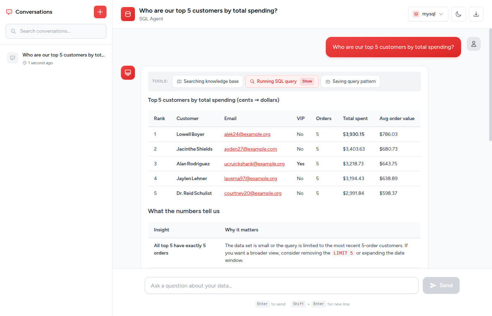
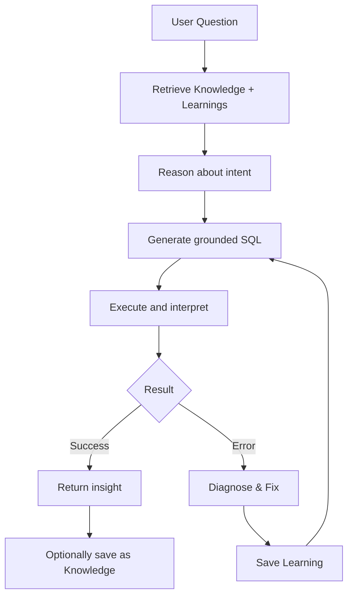

<p align="center">
  
</p>

# SQL Agent for Laravel

A self-learning text-to-SQL agent that turns natural language into accurate SQL — with context, memory, and a built-in chat UI.

<p align="center">
  
</p>

> **Beta Release** — The core API is stabilizing but may still change before v1.0.

## Quick Install

```bash
composer require knobik/sql-agent
php artisan sql-agent:install
```

Add your LLM provider to `.env`:

```env
SQL_AGENT_LLM_PROVIDER=openai   # or anthropic, ollama, gemini, mistral, xai...
SQL_AGENT_LLM_MODEL=gpt-4o
```

## Code Example

```php
use Knobik\SqlAgent\Facades\SqlAgent;

$response = SqlAgent::run('Who are our top 5 customers by spending?');

$response->answer;  // "Here are the top 5 customers..."
$response->sql;     // "SELECT c.name, SUM(o.total_amount) / 100 AS total_spent..."
$response->results; // [['name' => 'Lowell Boyer', 'total_spent' => 3930.15], ...]
```

## Why This Package?

- **Knowledge Base** — Curated table metadata, business rules, and query patterns give the LLM the context it needs
- **Self-Learning** — When a query fails and the agent recovers, it saves that learning. Next time, it knows.
- **Multi-Layer Context** — Schema introspection, semantic search, conversation history, and accumulated learnings
- **SQL Safety** — Configurable guardrails prevent destructive operations

## How It Works



The agent uses six context layers to ground its SQL generation:

| # | Layer | What it contains | Source |
|---|-------|-----------------|--------|
| 1 | Table Usage | Schema, columns, relationships | `knowledge/tables/*.json` |
| 2 | Human Annotations | Metrics, definitions, business rules | `knowledge/business/*.json` |
| 3 | Query Patterns | SQL known to work | `knowledge/queries/*.json` and `*.sql` |
| 4 | Learnings | Error patterns and discovered fixes | `save_learning` tool (on-demand) |
| 5 | Runtime Context | Live schema inspection | `introspect_schema` tool (on-demand) |
| 6 | Institutional Knowledge | Docs, wikis, external references | Custom tools (`agent.tools` config) |

Layers 1–3 are loaded from the knowledge base into the system prompt. Layer 4 is built up over time as the agent learns from errors. Layers 5 and 6 are available on-demand — the LLM calls them during the tool loop when it needs live schema details or external context.

## Features

- **Multi-LLM Support** - Any provider supported by [Prism PHP](https://prismphp.com) (OpenAI, Anthropic, Ollama, Gemini, Mistral, xAI, and more)
- **Multi-Database Support** - MySQL, PostgreSQL, SQLite, and SQL Server
- **Self-Learning** - Automatically learns from SQL errors and improves over time
- **Multiple Search Drivers** - Database full-text search or pgvector semantic search
- **Agentic Loop** - Uses tool calling to introspect schema, run queries, and refine results
- **Livewire Chat UI** - Ready-to-use chat interface with conversation history
- **Knowledge Base System** - Define table metadata, business rules, and query patterns
- **SQL Safety** - Configurable statement restrictions and row limits
- **Evaluation Framework** - Test your agent's accuracy with automated evaluations

## Requirements

- PHP 8.2 or higher
- Laravel 11.x or 12.x
- [Prism PHP](https://prismphp.com) (installed automatically as a dependency)
- An LLM API key or local Ollama installation
- Optional: Livewire 3.x for the chat UI
- Optional: PostgreSQL with pgvector for semantic similarity search via vector embeddings

## Documentation

**[Read the full documentation](https://knobik.github.io/sql-agent/)**

- [Configuration](https://knobik.github.io/sql-agent/guides/configuration/) - All config options (database, LLM, search, safety, etc.)
- [Knowledge Base](https://knobik.github.io/sql-agent/guides/knowledge-base/) - Table metadata, business rules, and query patterns
- [LLM & Search Drivers](https://knobik.github.io/sql-agent/guides/drivers/) - Configure LLM providers and search drivers
- [Artisan Commands](https://knobik.github.io/sql-agent/reference/commands/) - All available commands and options
- [Programmatic API](https://knobik.github.io/sql-agent/reference/api/) - Facade, streaming, and dependency injection
- [Web Interface](https://knobik.github.io/sql-agent/guides/web-interface/) - Livewire chat UI and debug mode
- [Evaluation](https://knobik.github.io/sql-agent/guides/evaluation/) - Test accuracy with automated evaluations
- [Self-Learning](https://knobik.github.io/sql-agent/guides/self-learning/) - Automatic learning from errors
- [Events](https://knobik.github.io/sql-agent/reference/events/) - Event hooks for custom behavior
- [Agent Tools](https://knobik.github.io/sql-agent/reference/tools/) - All LLM tools with parameters and JSON schemas
- [Database Support](https://knobik.github.io/sql-agent/reference/database-support/) - MySQL, PostgreSQL, SQLite, SQL Server
- [Troubleshooting](https://knobik.github.io/sql-agent/troubleshooting/) - Common issues and solutions

## Testing

```bash
# Run all tests
composer test

# Run with coverage
composer test-coverage
```

When testing code that uses SqlAgent, you can mock the facade:

```php
use Knobik\SqlAgent\Facades\SqlAgent;
use Knobik\SqlAgent\Contracts\AgentResponse;

public function test_it_handles_sql_agent_response(): void
{
    SqlAgent::shouldReceive('run')
        ->with('How many users?')
        ->andReturn(new AgentResponse(
            answer: 'There are 100 users.',
            sql: 'SELECT COUNT(*) FROM users',
            results: [['count' => 100]],
        ));

    $response = $this->post('/api/query', ['question' => 'How many users?']);

    $response->assertJson(['answer' => 'There are 100 users.']);
}
```

## Contributing

Please see [CONTRIBUTING.md](CONTRIBUTING.md) for details.

## License

SQL Agent for Laravel is open-sourced software licensed under the [Apache-2.0 License](LICENSE).
